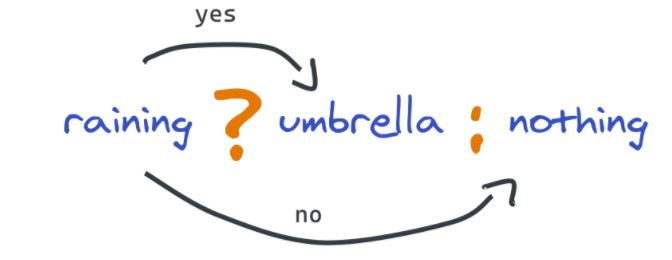

# **if-else Koşul yapıları**

Karşılaştırma operatörleri, değişkenler veya değerler arasındaki eşitlik ve farkı bulmak için kullanılır. Bu iki değerin karşılaştırmasını yaparak **true (doğru)** veya **false (yanlış)** sonucu verir.

```javascript
let price = "100";
let user = "Abdullah"
```
### Karşılaştırma Operatörleri
### == Eşitse

```javascript
// == Eşitse
console.log(price == 1);      //false
Output : false

console.log(price == 100);    //false
Output : true
```

### === Hem değeri hem de türü eşitse

```javascript
// === hem değeri hemde türü eşitse
console.log(price === 1);     //false
Output : false

console.log(price === 100);   //false
Output : false
```
### != Eşit değilse

```javascript
// != Eşit değilse
console.log(user != "guest")
Output : true
```

### < Küçükse

```javascript
// < küçükse
console.log("price < 100 : ", price < 100)
Output : price < 100 : false
```

### <= Küçük veya eşitse

```javascript
// <= küçük veya eşit ise
console.log("price < 100", price <= 100)
Output : price < 100 : true
```

### > Büyükse ve >= Büyük veya eşitse

```javascript
// > Büyükse
console.log("price < 100", price > 100)
Output : false
```

```javascript
// >= büyük veya eşit ise
console.log("price < 100", price >= 100)
Output : true
```

### Mantıksal Operatörler
### && ve

```javascript
// && ve
price = 0;
console.log(price > 0 && user != "guest")
Output : false
```

### || veya

```javascript
// || veya
console.log(price > 0 || user != "guest")
Output : true
```

### ! değil

```javascript
// ! değil (tersi) 
console.log(!(price > 0 && user == "guest"))
Output : true
```


## IF - ELSE KOŞUL YAPISI 

If else yapısı içerisinde koşulun sağlandığı kodlar if içerisinde yer alırken, koşulun sağlanmadığı kodlar ise else içerisinde yer alır.

Eğer ilk koşul yanlışsa başka bir koşul belirtmek amacıyla **else if** kullanılır. If/Else kullanımı aşağıdaki gibidir:


```javascript
let username = "Abdullah";

if (username.length > 0) {
    console.log(`Kullanici bilginiz ${username}`)
} else {
    console.log("bilgi yok")
}
Output : Kullanıcı bilginiz : Abdullah
```


## TERNARY OPERATOR

**Ternary Operator** 3 adet parametre alan tek JavaScript operatörüdür. If kullanarak kontrol etmek istediğimiz koşullarda ternary operator kullanarak satır sayısı olarak avantaj sağlayabiliriz.

### Ternary operatörünün aldığı 3 parametre şu şekildedir:

- İlk önce bir condition belirtiriz ve sonrasında hemen bir **?** koyarız
- Sonrasında, eğer yazdığımız condition doğru ise ne yapmak istediğimizi belirtir ve sonuna **:** koyarız
- Ve sıra geldi koşulumuz yanlış ise ne yapmak istediğimize.

Bu aşamaları görsel bir örnekle açıklayalım:



<br>

Gördüğümüz üzere eğer yağmur yağıyorsa **umbrella** dönecek, fakat yağmur yağmıyorsa **nothing** dönecek.

